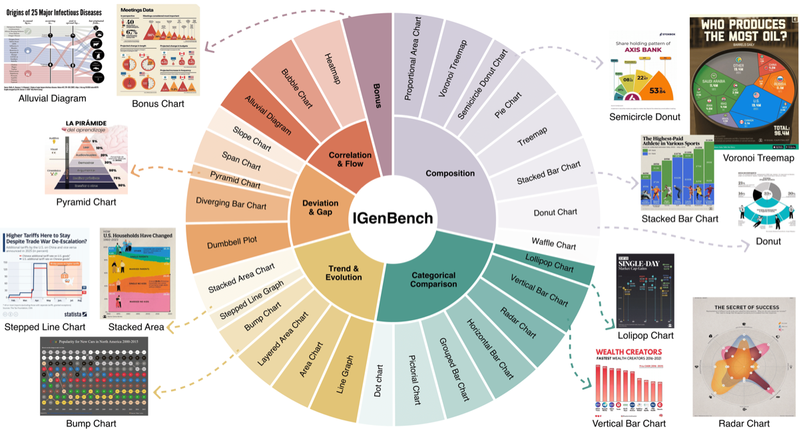

<p align="center">
    <a href="">

     </a>
   <p align="center">

<p align="center">
    <a href="https://arxiv.org/abs/2601.04498"></a>
    <a href="https://arxiv.org/abs/2601.04498"></a>
<a href="https://huggingface.co/datasets/Brookseeworld/IGenBench-Dataset"></a>
    <a href='https://igen-bench.vercel.app/'>
         </a>
</p>



# 🔬 About
>Text-to-image models can generate visually appealing infographics — but are they correct?

IGenBench focuses on information **reliability** — whether a generated infographic is factually correct, numerically accurate, and semantically faithful to the input text and data.


# 🔨 Installation

You need to first install uv as package manager.

Installation methods: https://docs.astral.sh/uv/getting-started/installation/

Then, run the following commands:

```bash
# Clone the repository
git clone https://github.com/MisterBrookT/IGenBench.git
cd IGenBench
uv sync

# Or install dev dependencies (optional)
uv sync --dev
```

Alternatively, install with pip:

```bash
pip install -e .
```

---
## 🔧 Prepare

Before running IGenBench, please complete the following preparation steps.

### Download Dataset

Download the benchmark dataset from Hugging Face:

```bash
# Using huggingface-hub (recommended)
mkdir hf_datasets
cd hf_datasets
hf download Brookseeworld/IGenBench-Dataset \
  --repo-type dataset \
  --local-dir .
```

### Set API Keys

IGenBench supports the following providers. Set the corresponding environment variable before running:

| Provider | Environment Variable | Supported Tasks |
|----------|---------------------|-----------------|
| Google | `GOOGLE_API_KEY` | Generation + Evaluation |
| OpenRouter | `OPENROUTER_API_KEY` | Generation + Evaluation |
| Replicate | `REPLICATE_API_TOKEN` | Generation only |

```bash
export GOOGLE_API_KEY="your-google-api-key"
export OPENROUTER_API_KEY="your-openrouter-api-key"
export REPLICATE_API_TOKEN="your-replicate-api-token"
```

To use the Replicate provider, install the extra dependency:

```bash
pip install "igenbench[replicate]"
# or with uv:
uv sync --extra replicate
```

---
# 💪 Usage

## Single Item

### Image Generation

Generate an infographic image from a text prompt:

```bash
igenbench gen \
  --info-path hf_datasets/data/1.json \
  --output-dir outputs/ \
  --provider google \
  --model gemini-2.5-flash-image
```

**Parameters:**
- `--info-path`: Path to the VISItem JSON file
- `--output-dir`: Directory to save generated images (default: `outputs/`)
- `--provider`: LLM provider (default: `google`)
- `--model`: Model name for generation (default: `gemini-2.0-flash-exp`)
- `--resume`: Resume from existing state to skip already generated images

### Evaluation

Evaluate a generated image using the benchmark questions:

```bash
igenbench eval \
  --info-path hf_datasets/data/1.json \
  --gen-model gemini-2.5-flash-image \
  --image-path outputs/1/1_gemini_2_5_flash_image.png \
  --output-dir outputs/ \
  --provider google \
  --model gemini-2.5-flash
```

**Parameters:**
- `--info-path`: Path to the VISItem JSON file
- `--gen-model`: Name of the model that generated the image
- `--image-path`: Path to the generated image (optional, auto-resolved if not provided)
- `--output-dir`: Directory to save evaluation results (default: `outputs/`)
- `--provider`: LLM provider for evaluation (default: `google`)
- `--model`: Model name for evaluation (default: `gemini-2.5-flash`)
- `--resume`: Resume from existing state to skip already evaluated questions

**Example output:**
```
09:54:29 | INFO | eval_workflow.py:75 | 🔍 Evaluating item 1 with gemini-2.5-flash on test-model
09:54:29 | INFO | eval_workflow.py:109 | ⏭️  Skipping question 1 / 8 (already evaluated by gemini-2.5-flash on test-model)
09:54:29 | INFO | eval_workflow.py:109 | ⏭️  Skipping question 2 / 8 (already evaluated by gemini-2.5-flash on test-model)
09:54:29 | INFO | eval_workflow.py:109 | ⏭️  Skipping question 3 / 8 (already evaluated by gemini-2.5-flash on test-model)
09:54:29 | INFO | eval_workflow.py:115 | 🔍 Evaluating item 1 with gemini-2.5-flash on test-model -> 4 / 8
09:54:32 | INFO | eval_workflow.py:115 | 🔍 Evaluating item 1 with gemini-2.5-flash on test-model -> 5 / 8
09:54:36 | INFO | eval_workflow.py:115 | 🔍 Evaluating item 1 with gemini-2.5-flash on test-model -> 6 / 8
09:54:39 | INFO | eval_workflow.py:115 | 🔍 Evaluating item 1 with gemini-2.5-flash on test-model -> 7 / 8
09:54:43 | INFO | eval_workflow.py:115 | 🔍 Evaluating item 1 with gemini-2.5-flash on test-model -> 8 / 8
09:54:48 | INFO | eval_cli.py:56 | ✅ Evaluation completed successfully for 1.json, saved to tmp/test_eval_output/1/1.json
```

## Batch Processing

Run generation or evaluation over the full dataset in one command. Both batch commands enable `--resume` by default, so interrupted runs continue from where they left off.

### Batch Generation

```bash
igenbench batch-gen \
  --data-dir hf_datasets/data/ \
  --output-dir outputs/ \
  --provider google \
  --model gemini-2.5-flash-image
```

### Batch Evaluation

```bash
igenbench batch-eval \
  --data-dir hf_datasets/data/ \
  --gen-model gemini-2.5-flash-image \
  --output-dir outputs/ \
  --provider google \
  --model gemini-2.5-flash
```

**Parameters** (both commands):
- `--data-dir`: Directory containing VISItem JSON files
- `--output-dir`: Directory to save results (default: `outputs/`)
- `--provider`: LLM provider (default: `google`)
- `--model`: Model name
- `--resume/--no-resume`: Resume from existing state (default: enabled)

## Score Aggregation

After evaluation, compute accuracy scores across all items:

```bash
igenbench score --output-dir outputs/
```

Filter by model and enable per-source / per-type breakdowns:

```bash
igenbench score \
  --output-dir outputs/ \
  --gen-model gemini-2.5-flash-image \
  --eval-model gemini-2.5-flash \
  --by-source \
  --by-type
```

**Parameters:**
- `--output-dir`: Directory containing evaluation results (default: `outputs/`)
- `--gen-model`: Filter by generation model (optional)
- `--eval-model`: Filter by evaluation model (optional)
- `--by-source/--no-by-source`: Break down scores by question source — `prompt` vs `seed` (default: enabled)
- `--by-type/--no-by-type`: Break down scores by question type (default: disabled)

**Example output:**
```
============================================================
IGenBench Scores  (200 items)
============================================================
Gen Model                    Eval Model             Accuracy    (correct/total)
------------------------------------------------------------
gemini-2.5-flash-image       gemini-2.5-flash         72.4%    (869/1200)
  [prompt]                                             74.3%    (446/600)
  [seed]                                               70.5%    (423/600)
============================================================
```

---

## Adding Custom Models

To add a new provider or model, implement a `LLMCaller` subclass in [`igenbench/utils/llm/llm_caller.py`](igenbench/utils/llm/llm_caller.py) and register it with the `@register_caller` decorator:

```python
from igenbench.utils.llm.caller_registry import register_caller
from igenbench.utils.llm.llm_caller import LLMCaller
from PIL.Image import Image as PILImage

@register_caller("my_provider")
class MyProviderCaller(LLMCaller):
    def __init__(self) -> None:
        # Initialize your API client here
        pass

    def generate_image(self, model: str, prompt: str, **kwargs) -> PILImage:
        # Call your image generation API and return a PIL Image
        ...

    def understand_image(self, model: str, prompt: str, image_path: str, **kwargs) -> str:
        # Call your vision API and return the text response
        ...
```

Then use it with `--provider my_provider`.

---

# 📝 Citation

If you find *IGenBench* useful for your research, please cite our paper:

```bibtex
@inproceedings{tang2026igenbench,
    title     = {IGenBench: Benchmarking the Reliability of Text-to-Infographic Generation},
    author    = {Yinghao Tang and Xueding Liu and Boyuan Zhang and Tingfeng Lan and Yupeng Xie and Jiale Lao and Yiyao Wang and Haoxuan Li and Tingting Gao and Bo Pan and Luoxuan Weng and Xiuqi Huang and Minfeng Zhu and Yingchaojie Feng and Yuyu Luo and Wei Chen},
    booktitle = {Proceedings of the 64th Annual Meeting of the Association for Computational Linguistics (ACL 2026)},
    year      = {2026},
    url       = {https://arxiv.org/abs/2601.04498},
}
```
