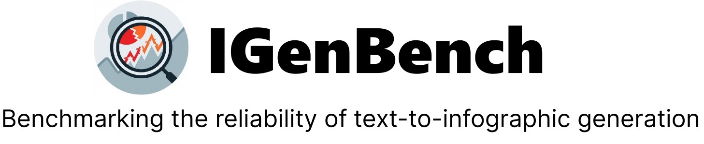
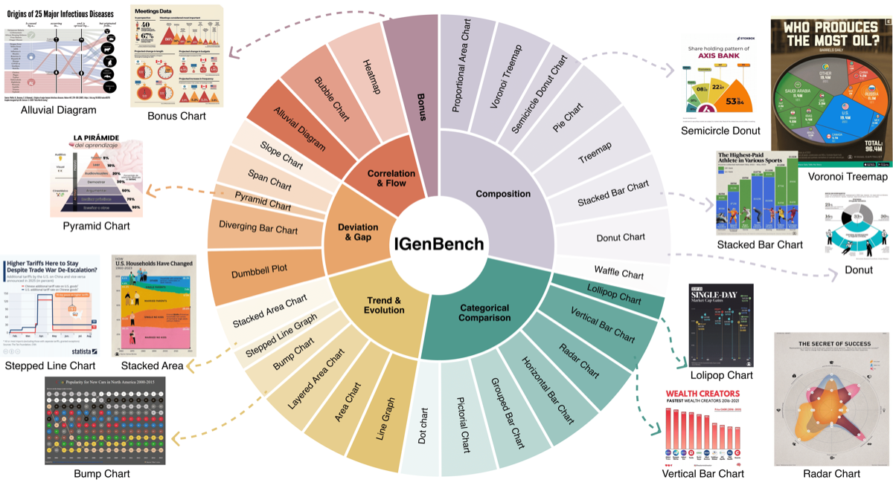

<p align="center">
  
</p>

<p align="center">
  <a href="https://arxiv.org/abs/2601.04498">Paper</a> |
  <a href="https://huggingface.co/datasets/Brookseeworld/IGenBench-Dataset">Dataset</a> |
  <a href="https://igen-bench.vercel.app/">Website</a>
</p>

If you run into any problem with this repo, such as a failed run, feel free to email me at yinghaotang@zju.edu.cn.

IGenBench (ACL 2026) tests whether text-to-image models generate infographics that are actually correct: right data, right numbers, faithful to the prompt. It has 600 test cases checked across 10 reliability dimensions.



## Results

| Model | Q-ACC | I-ACC |
|-------|:-----:|:-----:|
| Nanobanana-Pro | **0.90** | **0.49** |
| Seedream-4.5 | 0.61 | 0.06 |
| GPT-Image-1.5 | 0.55 | 0.12 |
| Nanobanana | 0.48 | 0.02 |
| Qwen-Image | 0.36 | 0.01 |
| Z-Image-Turbo | 0.35 | 0.00 |
| P-Image | 0.34 | 0.00 |
| Image-01 | 0.13 | 0.00 |
| HIDream-I1 | 0.11 | 0.00 |
| FLUX.1-dev | 0.10 | 0.00 |

Q-ACC is per-question accuracy. I-ACC counts an infographic as correct only if every question passes. Even the best model gets fewer than half of infographics fully right, and data completeness, encoding and ordering stay below 0.30 on average. Paper results were evaluated with `gemini-2.5-pro`.

## Quick start

```bash
git clone https://github.com/MisterBrookT/IGenBench.git
cd IGenBench
uv sync            # or: pip install -e .

hf download Brookseeworld/IGenBench-Dataset --repo-type dataset --local-dir hf_datasets
export GOOGLE_API_KEY=...   # or OPENROUTER_API_KEY / REPLICATE_API_TOKEN
```

Generate, evaluate and score the full dataset (interrupted runs resume automatically):

```bash
igenbench batch-gen  --data-dir hf_datasets/data/ --provider google --model gemini-2.5-flash-image
igenbench batch-eval --data-dir hf_datasets/data/ --gen-model gemini-2.5-flash-image --provider google --model gemini-2.5-pro
igenbench score --output-dir outputs/ --by-source --by-type
```

Use `igenbench gen` / `igenbench eval` with `--info-path` for a single item, and `--help` on any command for all options. Replicate is generation only and needs `uv sync --extra replicate`.

To add your own model, subclass `LLMCaller` in [`igenbench/utils/llm/llm_caller.py`](igenbench/utils/llm/llm_caller.py), register it with `@register_caller("my_provider")`, and pass `--provider my_provider`.

## Citation

```bibtex
@inproceedings{tang2026igenbench,
    title     = {IGenBench: Benchmarking the Reliability of Text-to-Infographic Generation},
    author    = {Yinghao Tang and Xueding Liu and Boyuan Zhang and Tingfeng Lan and Yupeng Xie and Jiale Lao and Yiyao Wang and Haoxuan Li and Tingting Gao and Bo Pan and Luoxuan Weng and Xiuqi Huang and Minfeng Zhu and Yingchaojie Feng and Yuyu Luo and Wei Chen},
    booktitle = {Proceedings of the 64th Annual Meeting of the Association for Computational Linguistics (ACL 2026)},
    year      = {2026},
    url       = {https://arxiv.org/abs/2601.04498},
}
```
